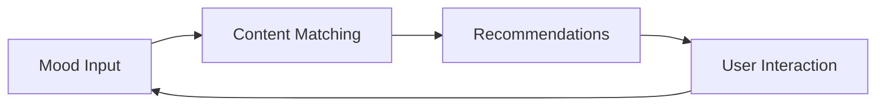
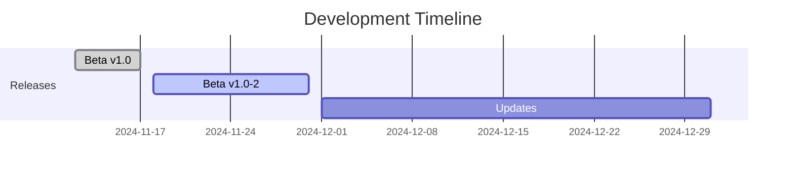

# 🎯 Cheerly

<div align="center">

```
  ______  __  __  ______  ______  ______  __      __  __
 /\  ___\/\ \_\ \/\  ___\/\  ___\/\  == \/\ \    /\ \_\ \
 \ \ \___\ \  __ \ \  __\\ \  __\\ \  __<\ \ \___\ \____ \
  \ \_____\ \_\ \_\ \_____\ \_____\ \_\ \_\ \_____\/\_____\
   \/_____/\/_/\/_/\/_____/\/_____/\/_/ /_/\/_____/\/_____/

```

*Your Personal Mood-Based Content Companion* 🎵 📺 📱


</div>

## 🌟 Why Cheerly?

> "In a world of endless content, find what resonates with you."

Cheerly is an innovative Android application that transforms how you discover digital content by understanding something deeply personal - your mood. Using smart content matching algorithms, we help you find the perfect videos, music, and content that align with your current emotional state.

### 🎯 For Users
Experience content discovery that adapts to your mood:

- 😊 **When You're Happy**
  - Uplifting music playlists
  - Positive video content
  - Feel-good recommendations
  
- 😔 **When You Need a Boost**
  - Motivational content
  - Calming music selections
  - Mood-lifting videos
  
- 🎯 **When You Need Focus**
  - Study music playlists
  - Productivity content
  - Concentration-enhancing videos
  
- 🌟 **Key Features**
  - Simple mood selection
  - Personalized recommendations
  - YouTube integration
  - Clean, intuitive interface

### 💼 For Investors

Cheerly represents an innovative approach in the digital content space:

- **Project Status**
  - 🚀 Feature complete beta release
  - 📱 Android platform launched
  - 🎯 Initial testing phase completed

- **Technical Foundation**
  - 🧠 Smart content matching system
  - 🔄 Real-time recommendation engine
  - 📱 Modern Android architecture

- **Current Development**
  - Beta testing underway
  - Security enhancements in progress
  - Performance optimization ongoing

### 👨‍💻 For Developers

Built with modern Android development practices:



#### 🏗️ Architecture Overview
```
📦 Clean Architecture
 ┣ 📂 Presentation Layer
 ┃ ┣ 🎨 Material Design UI
 ┃ ┗ 📱 MVVM Pattern
 ┣ 📂 Domain Layer
 ┃ ┣ 🧠 Mood Analysis
 ┃ ┗ 🎯 Content Matching
 ┗ 📂 Data Layer
   ┣ 🌐 API Integration
   ┗ 💾 Local Storage
```

#### 🛠️ Technical Implementation

- **Content Recommendation System**
  ```kotlin
  // Example of our recommendation implementation
  class VideoRepository {
      suspend fun getVideoRecommendations(mood: String): List<Video> =
          withContext(Dispatchers.IO) {
              // Fetch and filter content based on mood
          }
  }
  ```

- **Material Design Integration**
  ```kotlin
  // Clean UI implementation
  class VideoAdapter(private val videos: List<Video>) :
      RecyclerView.Adapter<VideoAdapter.VideoViewHolder>() {
          // Material Design components with clean architecture
  }
  ```

## 🎮 Current Features

<div align="center">

| Feature | Description | Status |
|---------|-------------|---------|
| 🎭 Mood Selection | Simple mood input interface | ✅ Complete |
| 🎥 Video Recommendations | YouTube content integration | ✅ Complete |
| 🎵 Music Suggestions | Mood-based playlists | ✅ Complete |
| 📱 Material Design UI | Modern Android interface | ✅ Complete |
| 🔄 Content Refresh | Real-time updates | ✅ Complete |

</div>

## 🚀 Development Status

### Current Release: v1.0-beta-1 (November 12, 2024)
- ✅ Core feature set implementation
- 🧪 Internal testing phase
- 📱 Android platform optimization

### Next Release: v1.0-beta-2 (November 18, 2024)
- 🔒 Enhanced security features
- ⚡ Performance improvements
- 🐛 Bug fixes and optimizations
- 🔄 Testing feedback integration

## 💡 Technology Stack

- **Frontend**
  - Kotlin
  - Android SDK
  - Material Design Components
  - MVVM Architecture

- **APIs & Services**
  - YouTube Data API
  - Retrofit2 & OkHttp3
  - Coil Image Loading
  - Local Storage

## 👥 Team

<div align="center">

| Role | Member | Focus |
|------|---------|---------|
| 👨‍💻 Technical Lead | Rajkumar | Architecture & Development |
| 🎨 Design | Cheerly Team | User Experience |
| 🔧 Development | Cheerly Team | Implementation |

</div>

## 🗺️ Future Development

- 🔄 Expanded mood categories
- 🎯 Enhanced recommendation algorithms
- ⚡ Performance optimizations
- 🌟 Additional content sources



---

<div align="center">

```
Built with 💙 by the Cheerly Team
Connecting Moods to Content
```

© 2024 Cheerly. All rights reserved.

</div>
